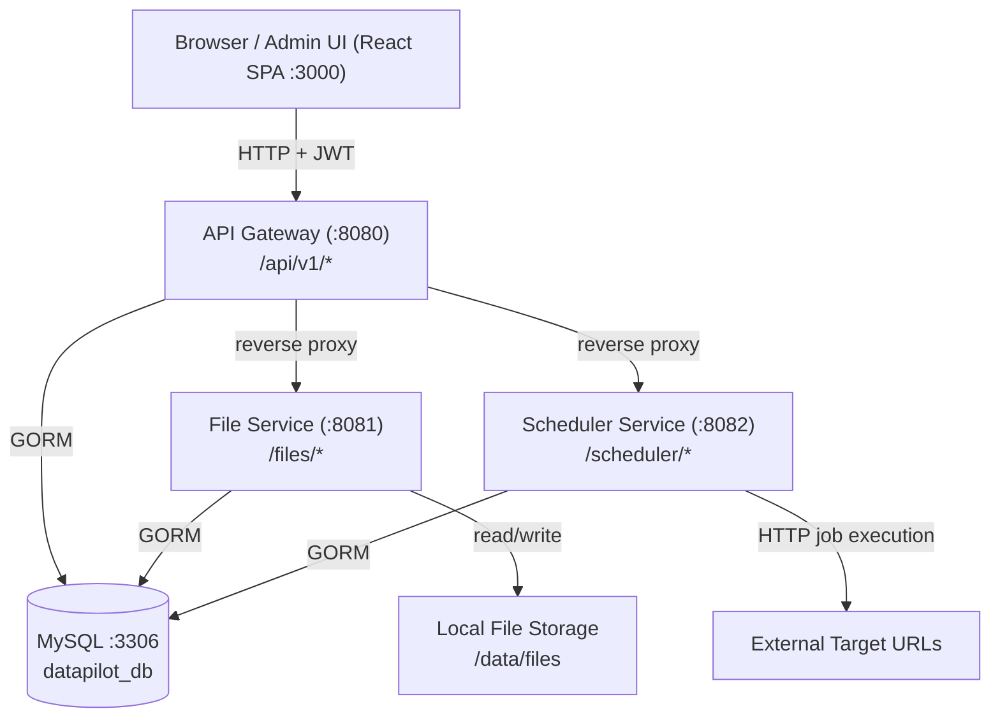

# Design Document: DataPilot Platform

## Overview

DataPilot is a microservices platform built for a solo entrepreneur that provides file management,
cron job scheduling, shared utilities, and a React admin UI. All backend services are written in
Go using the Gin HTTP framework and GORM ORM, backed by a single MySQL instance. A React SPA
serves as the admin frontend. All services are wired together via a single `docker-compose.yml`
for one-command startup.

The platform is intentionally simple: a monorepo with independent Go modules per service, a
shared Common Library, and an API Gateway that acts as the sole public entry point. This keeps
operational complexity low while remaining extensible for future DataPilot services.

### High-Level Component Diagram



---

## Architecture

### Monorepo Directory Structure

```
datapilot/
├── docker-compose.yml
├── .env.example
├── common/                         # Shared Go module (datapilot/common)
│   ├── go.mod
│   ├── config/
│   │   └── config.go
│   ├── logger/
│   │   └── logger.go
│   ├── database/
│   │   └── database.go
│   ├── middleware/
│   │   ├── jwt.go
│   │   ├── cors.go
│   │   ├── recovery.go
│   │   └── request_id.go
│   ├── pagination/
│   │   └── pagination.go
│   ├── client/
│   │   └── client.go
│   └── errors/
│       └── errors.go
├── gateway/                        # API Gateway service (datapilot/gateway)
│   ├── go.mod
│   ├── main.go
│   ├── handlers/
│   │   └── auth.go
│   ├── proxy/
│   │   └── proxy.go
│   └── Dockerfile
├── file-service/                   # File Service (datapilot/file-service)
│   ├── go.mod
│   ├── main.go
│   ├── models/
│   │   └── file_record.go
│   ├── handlers/
│   │   └── files.go
│   ├── storage/
│   │   └── local.go
│   └── Dockerfile
├── scheduler-service/              # Scheduler Service (datapilot/scheduler-service)
│   ├── go.mod
│   ├── main.go
│   ├── models/
│   │   ├── job.go
│   │   └── job_execution_log.go
│   ├── handlers/
│   │   └── jobs.go
│   ├── runner/
│   │   └── cron.go
│   └── Dockerfile
└── admin-ui/                       # React SPA
    ├── package.json
    ├── vite.config.ts
    ├── src/
    │   ├── main.tsx
    │   ├── App.tsx
    │   ├── api/
    │   │   ├── auth.ts
    │   │   ├── files.ts
    │   │   └── scheduler.ts
    │   ├── components/
    │   │   ├── Layout.tsx
    │   │   ├── StatCard.tsx
    │   │   ├── FileTable.tsx
    │   │   ├── JobTable.tsx
    │   │   ├── UploadForm.tsx
    │   │   ├── JobForm.tsx
    │   │   ├── LogDrawer.tsx
    │   │   └── ConfirmDialog.tsx
    │   ├── pages/
    │   │   ├── Login.tsx
    │   │   ├── Dashboard.tsx
    │   │   ├── Files.tsx
    │   │   └── Scheduler.tsx
    │   ├── store/
    │   │   └── auth.ts
    │   └── theme.ts
    └── Dockerfile
```

### Service Responsibilities

| Service | Port | Responsibility |
|---|---|---|
| API Gateway | 8080 | Auth, CORS, reverse proxy, health check |
| File Service | 8081 | File upload/download/list/delete |
| Scheduler Service | 8082 | Job CRUD, cron runner, execution logs |
| Admin UI | 3000 | React SPA (served by nginx in Docker) |
| MySQL | 3306 | Persistent storage for all services |

### Request Flow

1. Browser sends request to API Gateway on port 8080.
2. Gateway applies CORS middleware, then request-ID middleware, then JWT middleware (except `/health` and `/api/v1/auth/*`).
3. Gateway reverse-proxies the request to the appropriate upstream service, forwarding the `Authorization` header.
4. Upstream service validates JWT again via Common Library middleware, processes the request, and responds.
5. Gateway streams the upstream response back to the browser.

---

## Components and Interfaces

### Common Library

The Common Library is a Go module (`datapilot/common`) imported by all services. It is never
deployed independently.

#### Config (`common/config/config.go`)

```go
type Config struct {
    ServiceName    string
    HTTPPort       string
    MySQLDSN       string
    JWTSecret      string
    FileStoragePath string
    LogLevel       string
    AllowedOrigins string
}

func LoadConfig() (*Config, error)
```

- Reads from environment variables first, then falls back to a `.env` file via `godotenv`.
- Returns a descriptive error naming the missing variable when a required key is absent.
- Required keys: `SERVICE_NAME`, `HTTP_PORT`, `MYSQL_DSN`, `JWT_SECRET`.
- Optional keys with defaults: `FILE_STORAGE_PATH=/data/files`, `LOG_LEVEL=info`, `ALLOWED_ORIGINS=*`.

#### Logger (`common/logger/logger.go`)

```go
func NewLogger(serviceName, level string) *zap.Logger
```

- Uses `go.uber.org/zap` in production JSON mode.
- Every log entry includes `timestamp`, `level`, `service`, `trace_id`, and `message`.
- `trace_id` is injected from the Gin context (set by request-ID middleware).
- Log level filtering: DEBUG entries are suppressed when level is INFO or higher.

#### Database (`common/database/database.go`)

```go
func InitDB(dsn string, models ...interface{}) (*gorm.DB, error)
```

- Opens a GORM MySQL connection with `charset=utf8mb4&parseTime=True&loc=Local`.
- Sets `SetMaxOpenConns(25)` and `SetMaxIdleConns(10)`.
- Pings the database; returns error within 10 seconds if unreachable (context deadline).
- Calls `db.AutoMigrate(models...)` for all passed model structs.

#### JWT Middleware (`common/middleware/jwt.go`)

```go
func JWTAuth(secret string) gin.HandlerFunc
```

- Extracts `Authorization: Bearer <token>` header.
- Validates signature and expiry using `github.com/golang-jwt/jwt/v5`.
- On success: injects parsed `jwt.MapClaims` into context under key `"claims"`.
- On failure: aborts with HTTP 401 and standard JSON error body.

#### Recovery Middleware (`common/middleware/recovery.go`)

```go
func Recovery(logger *zap.Logger) gin.HandlerFunc
```

- Catches panics, logs the stack trace, and responds with HTTP 500 using the standard error struct.

#### Request ID Middleware (`common/middleware/request_id.go`)

```go
func RequestID() gin.HandlerFunc
```

- Reads `X-Request-ID` header; generates a UUID v4 if absent.
- Sets the value in the Gin context and echoes it in the response header.

#### Pagination (`common/pagination/pagination.go`)

```go
func Paginate(db *gorm.DB, page, limit int) *gorm.DB
func ParseParams(c *gin.Context) (page, limit int)

type PagedResponse struct {
    Total int64       `json:"total"`
    Page  int         `json:"page"`
    Limit int         `json:"limit"`
    Data  interface{} `json:"data"`
}
```

- `Paginate` applies `LIMIT` and `OFFSET` to the query scope.
- Maximum page size capped at 100. Page numbers below 1 default to 1.

#### Inter-Service Client (`common/client/client.go`)

```go
type Client struct {
    BaseURL    string
    HTTPClient *http.Client // 5-second timeout
}

func NewClient(baseURL string) *Client
func (c *Client) Do(ctx context.Context, method, path string, body interface{}) (*http.Response, error)
```

- Extracts JWT from Gin context and attaches it as `Authorization: Bearer <token>`.
- Returns `ErrTimeout` on 5-second deadline exceeded.
- Returns `ErrUpstream{StatusCode, Body}` on 4xx/5xx responses.

#### Error Types (`common/errors/errors.go`)

```go
type APIError struct {
    Error     string `json:"error"`
    Message   string `json:"message"`
    RequestID string `json:"request_id"`
}

func RespondError(c *gin.Context, status int, err, message string)
```

---

### API Gateway

The Gateway is a standalone Go service (`datapilot/gateway`). It owns the auth endpoints and
reverse-proxies everything else.

#### Auth Handler (`gateway/handlers/auth.go`)

```go
// POST /api/v1/auth/login
func Login(db *gorm.DB, jwtSecret string, logger *zap.Logger) gin.HandlerFunc

// POST /api/v1/auth/register
func Register(db *gorm.DB, logger *zap.Logger) gin.HandlerFunc
```

- `Login`: queries `users` table, compares bcrypt hash, returns signed JWT (24-hour expiry).
- `Register`: hashes password with bcrypt (cost 12), inserts new user row, returns HTTP 201.

#### Reverse Proxy (`gateway/proxy/proxy.go`)

```go
func NewProxy(target string) gin.HandlerFunc
```

- Uses `httputil.ReverseProxy` from the standard library.
- Forwards all headers including `Authorization`.
- Strips the gateway prefix before forwarding (e.g. `/api/v1/files/upload` → `/files/upload`).

#### Route Registration (`gateway/main.go`)

```
GET  /health                          → health handler (no auth)
POST /api/v1/auth/login               → auth handler (no auth)
POST /api/v1/auth/register            → auth handler (no auth)
ANY  /api/v1/files/*path              → JWTAuth → File Service proxy
ANY  /api/v1/scheduler/*path          → JWTAuth → Scheduler Service proxy
```

New upstream services are added by appending a new `ANY /api/v1/<prefix>/*path` group — no
changes to existing handlers required (Requirement 27.3).

---

### File Service

#### File Record Model (`file-service/models/file_record.go`)

```go
type FileRecord struct {
    ID               uint      `gorm:"primaryKey" json:"id"`
    OriginalFilename string    `json:"original_filename"`
    StoredFilename   string    `json:"stored_filename"`
    MIMEType         string    `json:"mime_type"`
    SizeBytes        int64     `json:"size_bytes"`
    UploaderIdentity string    `json:"uploader_identity"`
    StoragePath      string    `json:"-"`
    CreatedAt        time.Time `json:"created_at"`
    UpdatedAt        time.Time `json:"updated_at"`
}
```

#### Handlers (`file-service/handlers/files.go`)

| Handler | Route | Auth |
|---|---|---|
| `Upload` | `POST /files/upload` | JWT |
| `Download` | `GET /files/:id/download` | JWT |
| `List` | `GET /files` | JWT |
| `Delete` | `DELETE /files/:id` | JWT |

Upload flow:
1. Parse multipart form; enforce 100 MB limit via `c.Request.ParseMultipartForm(100 << 20)`.
2. Generate UUID v4 stored filename.
3. Write file to `<storage_path>/<uuid>.<ext>`.
4. Insert `FileRecord` via GORM.
5. Return HTTP 201 with the record.

#### Local Storage (`file-service/storage/local.go`)

```go
type LocalStorage struct{ BasePath string }
func (s *LocalStorage) Save(filename string, r io.Reader) (int64, error)
func (s *LocalStorage) Open(filename string) (io.ReadCloser, error)
func (s *LocalStorage) Delete(filename string) error
```

Abstracts filesystem operations behind an interface, making it straightforward to swap in S3 or
another backend later.

---

### Scheduler Service

#### Job Model (`scheduler-service/models/job.go`)

```go
type Job struct {
    ID             uint           `gorm:"primaryKey" json:"id"`
    Name           string         `json:"name"`
    CronExpression string         `json:"cron_expression"`
    TargetURL      string         `json:"target_url"`
    HTTPMethod     string         `json:"http_method"`
    Description    string         `json:"description"`
    Status         string         `json:"status"` // active | paused | deleted
    CronEntryID    int            `json:"-"`       // robfig/cron entry ID
    CreatedAt      time.Time      `json:"created_at"`
    UpdatedAt      time.Time      `json:"updated_at"`
    DeletedAt      gorm.DeletedAt `gorm:"index" json:"-"`
}
```

#### Job Execution Log Model (`scheduler-service/models/job_execution_log.go`)

```go
type JobExecutionLog struct {
    ID           uint      `gorm:"primaryKey" json:"id"`
    JobID        uint      `json:"job_id"`
    Status       string    `json:"status"` // success | failed
    ResponseCode int       `json:"response_code"`
    DurationMS   int64     `json:"duration_ms"`
    ErrorDetail  string    `json:"error_detail"`
    ExecutedAt   time.Time `json:"executed_at"`
}
```

#### Cron Runner (`scheduler-service/runner/cron.go`)

```go
type Runner struct {
    cron   *cron.Cron          // github.com/robfig/cron/v3
    db     *gorm.DB
    logger *zap.Logger
}

func NewRunner(db *gorm.DB, logger *zap.Logger) *Runner
func (r *Runner) Register(job *models.Job) error
func (r *Runner) Remove(entryID int)
func (r *Runner) Start()
func (r *Runner) Stop()
```

- Uses `robfig/cron/v3` with `cron.WithSeconds()` for optional 6-field expressions.
- On startup, loads all `active` jobs from MySQL and registers them.
- Each job's tick function: sends HTTP request to `target_url`, records execution log.
- Execution timeout: 10 seconds per job invocation.

#### Handlers (`scheduler-service/handlers/jobs.go`)

| Handler | Route | Auth |
|---|---|---|
| `CreateJob` | `POST /scheduler/jobs` | JWT |
| `ListJobs` | `GET /scheduler/jobs` | JWT |
| `UpdateJob` | `PUT /scheduler/jobs/:id` | JWT |
| `PauseJob` | `POST /scheduler/jobs/:id/pause` | JWT |
| `ResumeJob` | `POST /scheduler/jobs/:id/resume` | JWT |
| `DeleteJob` | `DELETE /scheduler/jobs/:id` | JWT |
| `GetLogs` | `GET /scheduler/jobs/:id/logs` | JWT |

---

### Admin UI

#### Technology Stack

- **React 18** + **TypeScript**
- **Vite** for bundling
- **React Router v6** for client-side routing
- **Axios** for HTTP (interceptor attaches JWT, handles 401 redirect)
- **Zustand** for auth state (JWT in localStorage)
- **Ant Design (antd)** for UI components — provides table, form, drawer, modal, upload primitives
- **cronstrue** npm package for human-readable cron descriptions (Requirement 24.3)

#### Color Theme (`src/theme.ts`)

```ts
export const theme = {
  token: {
    colorPrimary: '#6366f1',   // indigo — global primary
  },
  components: {
    // Files section: teal accent
    // Scheduler section: amber accent
  }
}
```

- Files section uses teal (`#0d9488`) as accent color for stat cards and table headers.
- Scheduler section uses amber (`#d97706`) as accent color.
- Login page uses a full-bleed gradient background.

#### Routing (`src/App.tsx`)

```
/login              → <Login>       (public)
/                   → <Dashboard>   (protected)
/files              → <Files>       (protected)
/scheduler          → <Scheduler>   (protected)
```

Protected routes check for a valid (non-expired) JWT in localStorage; redirect to `/login` if absent or expired.

#### State Management

- `src/store/auth.ts`: Zustand store holding `{ token, user, login(), logout() }`.
- `login()` stores JWT in localStorage; `logout()` clears it and navigates to `/login`.
- Axios interceptor reads token from store on every request.
- On 401 response: interceptor calls `logout()` automatically (handles expired JWT, Requirement 25.3).

#### API Layer (`src/api/`)

```ts
// auth.ts
export const login(username, password): Promise<{ token: string }>
export const register(username, password): Promise<void>

// files.ts
export const listFiles(page, limit): Promise<PagedResponse<FileRecord>>
export const uploadFile(file: File, onProgress): Promise<FileRecord>
export const downloadFile(id: number): Promise<void>   // triggers browser download
export const deleteFile(id: number): Promise<void>

// scheduler.ts
export const listJobs(page, limit, status?): Promise<PagedResponse<Job>>
export const createJob(data): Promise<Job>
export const updateJob(id, data): Promise<Job>
export const pauseJob(id): Promise<void>
export const resumeJob(id): Promise<void>
export const deleteJob(id): Promise<void>
export const getJobLogs(id, page, limit): Promise<PagedResponse<JobExecutionLog>>
```

#### Key Components

- `<Dashboard>`: fetches aggregate stats (file count, storage MB, job count, active jobs) and renders four `<StatCard>` components with color-coded icons.
- `<FileTable>`: antd `<Table>` with pagination, download and delete action columns. Delete triggers `<ConfirmDialog>`.
- `<UploadForm>`: antd `<Upload>` with drag-and-drop, shows progress bar, calls `uploadFile`.
- `<JobTable>`: antd `<Table>` with status badge (failed rows highlighted amber/red), pause/resume/delete actions, and a "Logs" button that opens `<LogDrawer>`.
- `<JobForm>`: antd `<Form>` with cron expression field that renders a live `cronstrue` description below the input.
- `<LogDrawer>`: antd `<Drawer>` showing last 50 execution logs for a selected job.

---

## Data Models

### MySQL Schema

All tables are created via GORM AutoMigrate. The canonical definitions live in the model structs;
the schema below documents the resulting DDL.

#### `users`

```sql
CREATE TABLE users (
    id         BIGINT UNSIGNED AUTO_INCREMENT PRIMARY KEY,
    username   VARCHAR(255) NOT NULL UNIQUE,
    password   VARCHAR(255) NOT NULL,  -- bcrypt hash
    created_at DATETIME(3) NOT NULL,
    updated_at DATETIME(3) NOT NULL,
    deleted_at DATETIME(3) NULL,
    INDEX idx_users_deleted_at (deleted_at)
);
```

#### `file_records`

```sql
CREATE TABLE file_records (
    id                 BIGINT UNSIGNED AUTO_INCREMENT PRIMARY KEY,
    original_filename  VARCHAR(255) NOT NULL,
    stored_filename    VARCHAR(255) NOT NULL UNIQUE,
    mime_type          VARCHAR(128) NOT NULL,
    size_bytes         BIGINT NOT NULL,
    uploader_identity  VARCHAR(255) NOT NULL,
    storage_path       VARCHAR(512) NOT NULL,
    created_at         DATETIME(3) NOT NULL,
    updated_at         DATETIME(3) NOT NULL
);
```

#### `jobs`

```sql
CREATE TABLE jobs (
    id              BIGINT UNSIGNED AUTO_INCREMENT PRIMARY KEY,
    name            VARCHAR(255) NOT NULL,
    cron_expression VARCHAR(128) NOT NULL,
    target_url      VARCHAR(1024) NOT NULL,
    http_method     VARCHAR(16) NOT NULL,
    description     TEXT,
    status          VARCHAR(32) NOT NULL DEFAULT 'active',
    cron_entry_id   INT NOT NULL DEFAULT 0,
    created_at      DATETIME(3) NOT NULL,
    updated_at      DATETIME(3) NOT NULL,
    deleted_at      DATETIME(3) NULL,
    INDEX idx_jobs_status (status),
    INDEX idx_jobs_deleted_at (deleted_at)
);
```

#### `job_execution_logs`

```sql
CREATE TABLE job_execution_logs (
    id            BIGINT UNSIGNED AUTO_INCREMENT PRIMARY KEY,
    job_id        BIGINT UNSIGNED NOT NULL,
    status        VARCHAR(32) NOT NULL,
    response_code INT NOT NULL DEFAULT 0,
    duration_ms   BIGINT NOT NULL DEFAULT 0,
    error_detail  TEXT,
    executed_at   DATETIME(3) NOT NULL,
    INDEX idx_job_execution_logs_job_id (job_id),
    INDEX idx_job_execution_logs_executed_at (executed_at)
);
```

### JWT Claims Structure

```json
{
  "sub": "<user_id>",
  "username": "<username>",
  "exp": <unix_timestamp>,
  "iat": <unix_timestamp>
}
```

---

## Correctness Properties

*A property is a characteristic or behavior that should hold true across all valid executions of a system — essentially, a formal statement about what the system should do. Properties serve as the bridge between human-readable specifications and machine-verifiable correctness guarantees.*

### Property 1: Config loading round-trip

*For any* complete set of valid environment variables, `LoadConfig` should return a `Config` struct whose fields exactly match the supplied values.

**Validates: Requirements 1.1**

---

### Property 2: Missing config key produces named error

*For any* required configuration key that is absent from the environment, `LoadConfig` should return an error whose message contains the name of that missing key.

**Validates: Requirements 1.2**

---

### Property 3: Log entries are valid JSON with required fields

*For any* log message emitted at any supported level, the output line should be valid JSON and contain all five required fields: `timestamp`, `level`, `service`, `trace_id`, and `message`.

**Validates: Requirements 2.1, 2.2**

---

### Property 4: JWT middleware passes valid tokens and injects claims

*For any* JWT signed with the correct secret and not yet expired, the `JWTAuth` middleware should allow the request to proceed and inject the token's claims into the Gin context under the key `"claims"`, such that the injected claims equal the original claims payload.

**Validates: Requirements 4.1, 4.2**

---

### Property 5: JWT middleware rejects invalid or absent tokens with HTTP 401

*For any* request carrying an expired token, a malformed token, a token signed with the wrong secret, or no `Authorization` header at all, the `JWTAuth` middleware should abort the request with HTTP 401 and a JSON error body.

**Validates: Requirements 4.3, 4.4**

---

### Property 6: Pagination applies correct LIMIT and OFFSET

*For any* page number ≥ 1 and limit between 1 and 100, `Paginate` should produce a query scope whose SQL contains `LIMIT <limit> OFFSET <(page-1)*limit>`.

**Validates: Requirements 5.1**

---

### Property 7: Pagination caps limit at 100

*For any* limit value greater than 100, `Paginate` should apply a limit of exactly 100 regardless of the supplied value.

**Validates: Requirements 5.2**

---

### Property 8: Pagination defaults sub-1 page to page 1

*For any* page number less than or equal to 0, `Paginate` should produce the same query scope as page 1 (i.e., OFFSET 0).

**Validates: Requirements 5.3**

---

### Property 9: Inter-service client forwards JWT header

*For any* JWT present in the calling context, the outbound HTTP request made by `Inter_Service_Client` should carry an `Authorization: Bearer <token>` header whose value exactly matches the context JWT.

**Validates: Requirements 6.2**

---

### Property 10: Inter-service client returns typed error on 4xx/5xx

*For any* HTTP response with status code in the 4xx or 5xx range from the target service, `Inter_Service_Client` should return an `ErrUpstream` error containing the exact status code and response body.

**Validates: Requirements 6.4**

---

### Property 11: Gateway proxies requests to correct upstream by prefix

*For any* request path under `/api/v1/files/*` or `/api/v1/scheduler/*`, the API Gateway should forward the request to the corresponding upstream service, and the upstream should receive the request with the path stripped of the gateway prefix.

**Validates: Requirements 7.2, 7.3**

---

### Property 12: Gateway returns 404 for unregistered routes

*For any* request path that does not match a registered route prefix, the API Gateway should respond with HTTP 404 and a JSON error body.

**Validates: Requirements 7.4**

---

### Property 13: Gateway forwards Authorization header unchanged

*For any* `Authorization` header value sent to the gateway, the proxied request received by the upstream service should carry the identical header value.

**Validates: Requirements 7.5**

---

### Property 14: Health endpoint reports unreachable services

*For any* subset of registered upstream services that are unreachable, the `GET /health` response body should include each unreachable service's name and a non-ok status indicator.

**Validates: Requirements 8.2**

---

### Property 15: File upload persists record with complete metadata

*For any* valid multipart file upload, the resulting `FileRecord` in MySQL should contain the correct original filename, MIME type, file size in bytes, uploader identity (from JWT claims), and a non-zero upload timestamp.

**Validates: Requirements 9.1, 9.3**

---

### Property 16: Uploaded files receive unique stored filenames

*For any* two file upload requests (even with identical original filenames), the `stored_filename` values in the resulting `FileRecord` rows should be distinct.

**Validates: Requirements 9.2**

---

### Property 17: Files larger than 100 MB are rejected with HTTP 413

*For any* upload request whose file payload exceeds 100 MB, the File Service should respond with HTTP 413 and a JSON error body, and no `FileRecord` should be created.

**Validates: Requirements 9.4**

---

### Property 18: File download round-trip preserves bytes and headers

*For any* file that has been successfully uploaded, a subsequent download request for that file's ID should return the exact same bytes with a `Content-Type` header matching the recorded MIME type and a `Content-Disposition` header containing the original filename.

**Validates: Requirements 10.1**

---

### Property 19: Non-existent file ID returns HTTP 404

*For any* file ID that does not exist in MySQL, both download and delete requests should respond with HTTP 404 and a JSON error body.

**Validates: Requirements 10.2, 12.2**

---

### Property 20: File list is ordered by upload timestamp descending

*For any* set of uploaded files, the `GET /files` response should return records ordered such that each record's `created_at` is greater than or equal to the `created_at` of the record that follows it, and the response body should contain `total`, `page`, `limit`, and `data` fields.

**Validates: Requirements 11.1, 11.3**

---

### Property 21: File deletion removes both storage file and DB record

*For any* existing file, after a successful `DELETE /files/:id` request, neither the physical file in storage nor the `FileRecord` row in MySQL should exist.

**Validates: Requirements 12.1**

---

### Property 22: Job creation persists with active status

*For any* valid job creation request, the resulting `Job` row in MySQL should have `status = "active"` and the job should be registered in the cron runner.

**Validates: Requirements 14.1, 14.3**

---

### Property 23: Invalid cron expression is rejected with HTTP 422 and leaves state unchanged

*For any* invalid cron expression string (whether in a create or update request), the Scheduler Service should respond with HTTP 422 and a JSON error body, and no job record should be created or modified.

**Validates: Requirements 14.2, 16.3**

---

### Property 24: Job list is ordered by creation timestamp descending with status filter

*For any* set of jobs and any optional `status` filter value (`active`, `paused`, or `deleted`), the `GET /scheduler/jobs` response should return only jobs matching the filter (if supplied), ordered by `created_at` descending.

**Validates: Requirements 15.1, 15.3**

---

### Property 25: Job update persists new values

*For any* existing job and any valid update payload, after a successful `PUT /scheduler/jobs/:id` request, the `Job` row in MySQL should reflect the updated field values.

**Validates: Requirements 16.1**

---

### Property 26: Pause then resume restores active status (round-trip)

*For any* active job, pausing it should set its status to `"paused"`, and subsequently resuming it should set its status back to `"active"` — restoring the job to its original operational state.

**Validates: Requirements 17.1, 17.2**

---

### Property 27: Deleted job is soft-deleted and excluded from default listing

*For any* existing job, after a `DELETE /scheduler/jobs/:id` request, the job's `deleted_at` field should be set to a non-null timestamp, and the job should not appear in the default (unfiltered) job list response.

**Validates: Requirements 18.1**

---

### Property 28: Job execution log reflects HTTP outcome

*For any* job execution, the resulting `JobExecutionLog` entry should have `status = "success"` if the target URL responded with HTTP 2xx, and `status = "failed"` with a non-empty `error_detail` if the target responded with 4xx/5xx or timed out — and in all cases the entry should record the `duration_ms` and `executed_at` timestamp.

**Validates: Requirements 19.2, 19.3**

---

### Property 29: Execution log list is ordered by execution timestamp descending

*For any* job with multiple execution log entries, the `GET /scheduler/jobs/:id/logs` response should return entries ordered such that each entry's `executed_at` is greater than or equal to the `executed_at` of the entry that follows it.

**Validates: Requirements 20.1**

---

### Property 30: Login returns valid JWT with 24-hour expiry

*For any* registered user with correct credentials, `POST /api/v1/auth/login` should return a JWT that is valid (verifiable with the server's secret) and whose `exp` claim is approximately 24 hours after the `iat` claim.

**Validates: Requirements 26.1**

---

### Property 31: Invalid credentials return HTTP 401

*For any* login request with a username that does not exist or a password that does not match the stored bcrypt hash, the response should be HTTP 401 with a JSON error body.

**Validates: Requirements 26.2**

---

### Property 32: Passwords are always stored as bcrypt hashes

*For any* user registration or password update, the `password` field stored in the `users` table should be a valid bcrypt hash (not plaintext), and a subsequent login with the original plaintext password should succeed.

**Validates: Requirements 26.3, 26.4**

---

### Property 33: All error responses contain required JSON fields

*For any* error response from any service endpoint, the JSON body should contain all three fields: `error`, `message`, and `request_id`, where `request_id` is non-empty.

**Validates: Requirements 28.1, 28.3**

---

### Property 34: CORS headers are present for configured origins

*For any* HTTP request originating from a domain listed in `ALLOWED_ORIGINS`, the response should include `Access-Control-Allow-Origin` matching that origin, and `Access-Control-Allow-Headers` should include `Authorization`, `Content-Type`, and `X-Request-ID`.

**Validates: Requirements 29.1, 29.3**

---

## Error Handling

### Standard Error Response

All services use the `APIError` struct from the Common Library:

```json
{
  "error": "NOT_FOUND",
  "message": "file record with id 42 does not exist",
  "request_id": "550e8400-e29b-41d4-a716-446655440000"
}
```

### Error Mapping

| Condition | HTTP Status | `error` field |
|---|---|---|
| Resource not found | 404 | `NOT_FOUND` |
| Invalid request body / validation | 422 | `VALIDATION_ERROR` |
| File too large | 413 | `FILE_TOO_LARGE` |
| Unauthenticated | 401 | `UNAUTHORIZED` |
| Forbidden | 403 | `FORBIDDEN` |
| Storage write failure | 500 | `STORAGE_ERROR` |
| Database error | 500 | `DATABASE_ERROR` |
| Unhandled panic | 500 | `INTERNAL_ERROR` |
| Upstream timeout | 504 | `UPSTREAM_TIMEOUT` |

### Panic Recovery

The `Recovery` middleware (registered on every service) catches panics, logs the full stack trace
at ERROR level with the `request_id`, and returns HTTP 500 with the standard error struct.

### Request ID Propagation

Every inbound request gets a `request_id` (from `X-Request-ID` header or generated UUID). This
value is:
- Stored in the Gin context.
- Included in every log entry for that request.
- Returned in every response (success or error) as the `request_id` field.
- Forwarded by the gateway to upstream services via the `X-Request-ID` header.

---

## Inter-Service Communication

### Patterns

1. **Gateway → Upstream (reverse proxy)**: The gateway uses `httputil.ReverseProxy`. No service
   discovery — upstream addresses are configured via environment variables
   (`FILE_SERVICE_URL`, `SCHEDULER_SERVICE_URL`).

2. **Service → Service (direct HTTP)**: Any service that needs to call another uses the
   `Inter_Service_Client` from the Common Library. The client forwards the caller's JWT
   automatically, so downstream services can authenticate the request.

3. **Scheduler → External targets (job execution)**: The cron runner makes outbound HTTP calls
   to arbitrary `target_url` values. These are fire-and-forget from the job's perspective; the
   result is recorded in `job_execution_logs` regardless of outcome.

### Service Discovery

For the initial deployment, service addresses are static environment variables. The gateway reads
`FILE_SERVICE_URL` and `SCHEDULER_SERVICE_URL` at startup. Adding a new service requires only a
new environment variable and a new route group in `gateway/main.go`.

### Timeout Budget

| Hop | Timeout |
|---|---|
| Browser → Gateway | 30 s (nginx/OS default) |
| Gateway → Upstream | 30 s (ReverseProxy transport) |
| Inter-Service Client | 5 s |
| Scheduler job execution | 10 s |

---

## Docker Compose Topology

```yaml
# docker-compose.yml (abbreviated structure)
services:
  mysql:
    image: mysql:8.0
    environment:
      MYSQL_ROOT_PASSWORD: ${MYSQL_ROOT_PASSWORD}
      MYSQL_DATABASE: datapilot_db
    volumes:
      - mysql_data:/var/lib/mysql
    healthcheck:
      test: ["CMD", "mysqladmin", "ping", "-h", "localhost"]
      interval: 10s
      retries: 5

  gateway:
    build: ./gateway
    ports: ["8080:8080"]
    environment:
      MYSQL_DSN: root:${MYSQL_ROOT_PASSWORD}@tcp(mysql:3306)/datapilot_db?...
      FILE_SERVICE_URL: http://file-service:8081
      SCHEDULER_SERVICE_URL: http://scheduler-service:8082
    depends_on:
      mysql: { condition: service_healthy }

  file-service:
    build: ./file-service
    ports: ["8081:8081"]
    volumes:
      - file_storage:/data/files
    environment:
      MYSQL_DSN: root:${MYSQL_ROOT_PASSWORD}@tcp(mysql:3306)/datapilot_db?...
      FILE_STORAGE_PATH: /data/files
    depends_on:
      mysql: { condition: service_healthy }

  scheduler-service:
    build: ./scheduler-service
    ports: ["8082:8082"]
    environment:
      MYSQL_DSN: root:${MYSQL_ROOT_PASSWORD}@tcp(mysql:3306)/datapilot_db?...
    depends_on:
      mysql: { condition: service_healthy }

  admin-ui:
    build: ./admin-ui
    ports: ["3000:80"]
    environment:
      VITE_API_BASE_URL: http://localhost:8080

volumes:
  mysql_data:
  file_storage:
```

All services depend on MySQL's health check, ensuring the database is ready before any service
attempts to connect. A single `docker compose up --build` starts the entire platform.

---

## Testing Strategy

### Dual Testing Approach

Both unit tests and property-based tests are required. They are complementary:

- **Unit tests** verify specific examples, integration points, and error conditions.
- **Property-based tests** verify universal properties across many generated inputs.

### Property-Based Testing

**Library**: [`github.com/leanovate/gopter`](https://github.com/leanovate/gopter) for Go services;
[`fast-check`](https://github.com/dubzzz/fast-check) for the React admin UI.

**Configuration**: Each property test runs a minimum of **100 iterations**.

**Tag format** (comment above each test):
```
// Feature: datapilot-platform, Property <N>: <property_text>
```

Each correctness property listed above must be implemented by exactly one property-based test.

### Unit Testing

**Go services**: `testing` standard library + `testify` for assertions.
**React UI**: Vitest + React Testing Library.

Unit tests focus on:
- Specific examples demonstrating correct behavior (e.g., health endpoint returns `{"status":"ok"}`).
- Integration points (e.g., `InitDB` sets correct connection pool limits).
- Error conditions (e.g., panic recovery returns HTTP 500, storage-not-writable returns HTTP 500).
- Edge cases (e.g., log level filtering suppresses DEBUG at INFO level).

### Test Organization

```
common/
  config/config_test.go       # Properties 1, 2
  logger/logger_test.go       # Property 3
  middleware/jwt_test.go      # Properties 4, 5
  pagination/pagination_test.go # Properties 6, 7, 8
  client/client_test.go       # Properties 9, 10

gateway/
  handlers/auth_test.go       # Properties 30, 31, 32
  proxy/proxy_test.go         # Properties 11, 12, 13, 14
  middleware/cors_test.go     # Property 34

file-service/
  handlers/files_test.go      # Properties 15, 16, 17, 18, 19, 20, 21

scheduler-service/
  handlers/jobs_test.go       # Properties 22, 23, 24, 25, 26, 27
  runner/cron_test.go         # Properties 28, 29
```

### Integration Tests

A `docker-compose.test.yml` spins up MySQL and all services, then runs end-to-end tests covering:
- Full auth flow (register → login → access protected endpoint).
- File upload → list → download → delete round-trip.
- Job create → pause → resume → delete lifecycle.
- Scheduler execution log capture.
